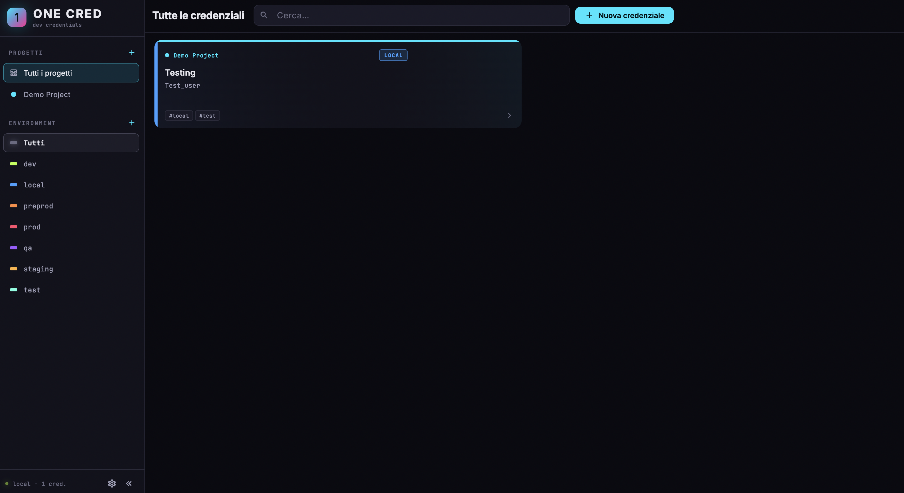
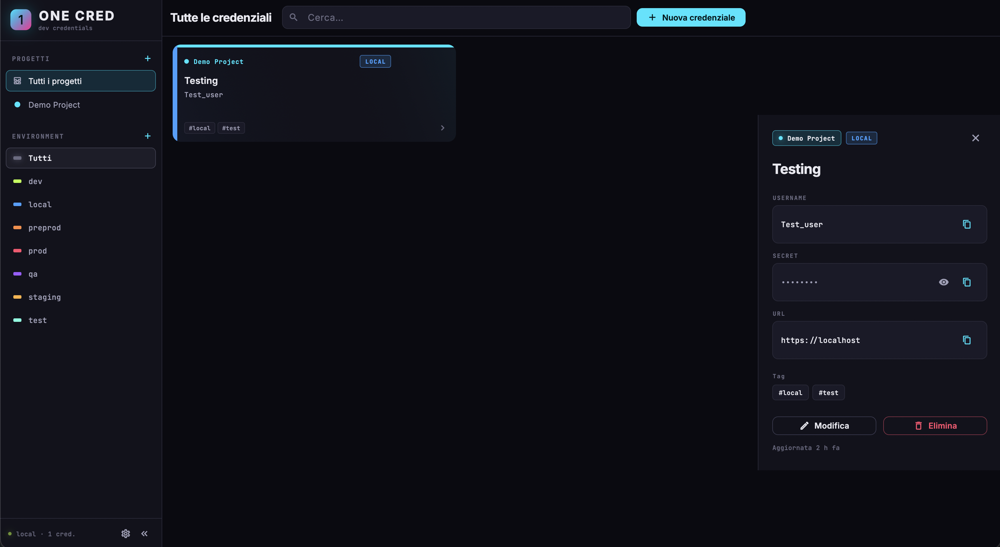
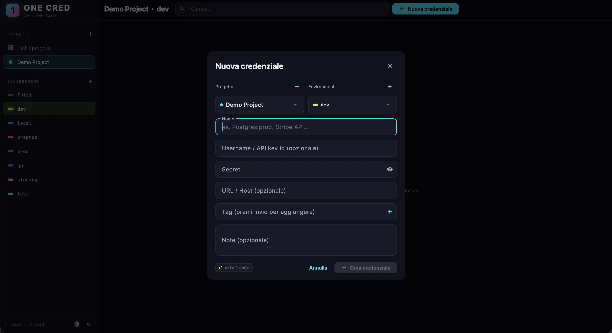
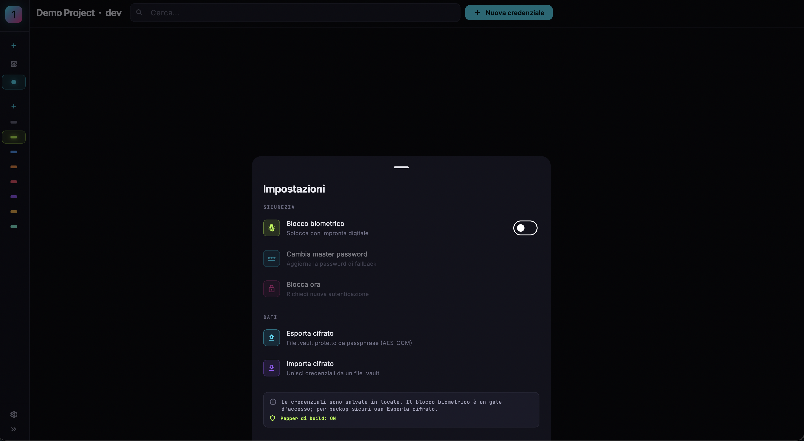

# One Cred

[](https://github.com/IsD4n73/Credential-Manager/actions/workflows/build.yml)
[](LICENSE)

A local‑first credential manager built for developers. Cross‑platform (Android · macOS · Windows). Open source under MIT.

```
 ╔═════════════════════════════════════════════════════════════╗
 ║   1   One credential vault. Local. Encrypted. Yours.        ║
 ╚═════════════════════════════════════════════════════════════╝
```

- **Local‑first SQLite** — no cloud, no account.
- **Projects + environments** — colour‑coded for instant visual scanning.
- **Two‑factor unlock** — biometric (Face ID / Touch ID / fingerprint / Windows Hello) with a **master password fallback** that's always available, even when biometric is unavailable or fails.
- **Encrypted import/export** — PBKDF2‑HMAC‑SHA256 (200k iterations) + AES‑GCM‑256 with an optional bundled pepper.
- **Localized** with `easy_localization` — Italian and English, device‑locale follow, English fallback.
- **Sidebar UI** with collapse / icon‑only mode and a dark neon theme with bright accents.
- **Automated builds** — every push produces signed Android APK and Windows artifacts via GitHub Actions.

---

## Table of contents

1. [Screenshots](#screenshots)
2. [Quick start](#quick-start)
3. [Project layout](#project-layout)
4. [Build for each platform](#build-for-each-platform)
5. [Continuous integration](#continuous-integration)
6. [Sensitive values — the `.env` file](#sensitive-values--the-env-file)
7. [Security model](#security-model)
8. [Master password & biometric flow](#master-password--biometric-flow)
9. [Localization](#localization)
10. [Regenerating the app icons](#regenerating-the-app-icons)
11. [Contributing](#contributing)
12. [License](#license)

---

## Screenshots

macOS:

| Home | Credential detail |
|------|-------------------|
|  |  |

| New credential dialog | Settings sheet |
|-----------------------|----------------|
|  |  |

> Windows / Android screenshots will land in the same [`assets/screens/`](assets/screens/) folder with `windows-*.png` / `android-*.png` prefixes.

---

## Quick start

Requirements:

- **Flutter 3.41.9** (matches the CI matrix and the Dart `^3.11.5` pin in `pubspec.yaml`).
- **Xcode** for macOS, **Visual Studio + C++ desktop workload** for Windows, **Android Studio / JDK 17** for Android.

```bash
git clone https://github.com/<your-org>/one-cred.git
cd one-cred

# .env is git-ignored — copy the template and (optionally) add your pepper
cp .env.example .env
$EDITOR .env

flutter pub get
flutter run -d macos      # or windows / android
```

> **First launch tip.** The app seeds a `Demo Project` and the default environments (`local`, `dev`, `staging`, `qa`, `test`, `preprod`, `prod`). Delete the demo and start adding your own projects from the sidebar.

## Project layout

```
lib/
├─ db/                       SQLite schema + CRUD (sqflite + sqflite_common_ffi)
├─ dialogs/                  Project, env, credential, passphrase, settings sheet
├─ models/                   Project, EnvDef, Credential
├─ screens/                  HomeShell, LockScreen, AppLockGate
├─ security/                 BiometricService, MasterPasswordService, VaultCrypto, VaultIO
├─ state/                    AppState, LockController, UiPrefs
├─ theme/                    AppTheme, AppColors, env palettes
└─ widgets/
   ├─ common/                Shared widgets (BrandMark, GlowDot, EnvBadge, ConfirmDialog, ColorSwatchPicker, …)
   ├─ credential/            ReadableField, SecretField, CopyIconButton
   ├─ sidebar/               Brand, section header, project / env / footer tiles
   ├─ credential_card.dart
   ├─ credential_detail.dart
   ├─ credential_list.dart
   ├─ empty_state.dart
   ├─ mobile_detail_sheet.dart
   └─ top_bar.dart

assets/translations/         en.json, it.json — loaded by easy_localization
assets/icon/                 Source PNG + generator script for app icons
.github/workflows/           CI definitions (build.yml)
.env                         Loaded at runtime by flutter_dotenv (git-ignored)
android/ macos/ windows/     Platform shells (manifests, entitlements, .rc)
```

Each widget lives in its own file: the codebase favours many small, single‑purpose files over a few large ones. The shared atoms in `lib/widgets/common/` (e.g. `BrandMark`, `GlowDot`, `EnvBadge`, `SectionLabel`, `SettingsRow`, `ConfirmDialog`, `LabeledDropdown`, `ColorSwatchPicker`) are reused across the dialogs, the lock screen and the sidebar.

## Build for each platform

All commands assume you have done `cp .env.example .env && flutter pub get`. The `.env` file is bundled as a Flutter asset, so a build picks it up automatically — no extra flags required.

### macOS

```bash
flutter run    -d macos                # dev
flutter build  macos    --release
open build/macos/Build/Products/Release/"One Cred.app"
```

The macOS shell is sandboxed; the entitlement `com.apple.security.files.user-selected.read-write` is enabled so file‑picker import/export works. Biometric prompts go through `LocalAuthentication`, with `NSFaceIDUsageDescription` set in `Info.plist`.

### Windows

```powershell
flutter run    -d windows
flutter build  windows    --release
# build\windows\x64\runner\Release\One Cred.exe
```

Biometric on Windows uses Windows Hello when available.

### Android

```bash
flutter run    -d <android-id>
flutter build  apk             --release
flutter build  appbundle       --release    # Play Store
```

`MainActivity` extends `FlutterFragmentActivity` (required by `local_auth`). The manifest declares `USE_BIOMETRIC` and `USE_FINGERPRINT`.

## Continuous integration

Every push (any branch) and every pull request triggers [`.github/workflows/build.yml`](.github/workflows/build.yml), which produces:

| Platform | Artifact | Where |
|----------|----------|-------|
| Android  | `app-release.apk` | Actions tab → run → `one-cred-android-<sha>` |
| Windows  | `one-cred-windows.zip` | Actions tab → run → `one-cred-windows-<sha>` |

The workflow:

1. Sets up **Flutter 3.41.9** (and **JDK 17** for the Android job) via [`subosito/flutter-action`](https://github.com/subosito/flutter-action).
2. Provisions a `.env` from the optional **`APP_PEPPER`** GitHub Actions secret, falling back to `.env.example` when the secret isn't set. Add a repository secret named `APP_PEPPER` to bake your team's pepper into CI builds.
3. Runs `flutter analyze` (build fails on any analyzer error).
4. Builds release artifacts and uploads them with 14‑day retention.

To trigger a manual build, use the **Run workflow** button on the Actions page or `workflow_dispatch`.

## Sensitive values — the `.env` file

`One Cred` keeps secrets out of the source tree. The `.env` at the repo root is loaded at app start by **`flutter_dotenv`** and bundled as an asset (declared in `pubspec.yaml > flutter > assets`). It is **git‑ignored**, so every developer ships their own personal build.

| Variable     | Type   | Purpose |
|--------------|--------|---------|
| `APP_PEPPER` | string | Extra secret blended into PBKDF2 alongside the user passphrase. Two installs with different peppers produce non‑interoperable `.vault` exports. Empty by default. |

Generate a strong pepper:

```bash
openssl rand -hex 32        # macOS / Linux
# or
[Convert]::ToHexString([System.Security.Cryptography.RandomNumberGenerator]::GetBytes(32))   # PowerShell
```

then put it into `.env`:

```
APP_PEPPER=<your-hex-string>
```

> **Limitation worth knowing.** Because the `.env` is bundled as an asset, the value lives inside the app bundle and can be extracted from a release build by anyone with access to the binary. The pepper still raises the cost of attacking an *exported* `.vault` file (the attacker would need to also obtain the binary), but it is not a substitute for a strong user passphrase. If you want a higher bar, integrate platform‑specific secure storage (Keychain / Keystore / DPAPI) — see the roadmap.

## Security model

`One Cred` makes intentional, honest trade‑offs. Read this before trusting it with your secrets.

1. **At rest, the on‑device database is NOT encrypted.** Credentials live in a SQLite file under the platform's per‑app application‑support directory. The biometric lock is an **access gate at the UI layer**, not encryption at rest. Anyone with root/admin access to your device can read the DB directly.
   - *Roadmap:* swap in SQLCipher behind the same `AppDatabase` API for users who want at‑rest encryption.

2. **The unlock gate** combines two factors (see [Master password & biometric flow](#master-password--biometric-flow)):
   - **Biometric** — Face ID / Touch ID / fingerprint / Windows Hello via the OS APIs.
   - **Master password** — PBKDF2‑HMAC‑SHA256 (200k iterations) over a 16‑byte salt. Only the hash and salt are stored (in `SharedPreferences`). Constant‑time comparison on verify.
   - When biometric is enabled, the master password is **always** set up first so the user has a fallback if biometric is removed, denied or fails repeatedly.

3. **Exported `.vault` files ARE encrypted.** Format:

   ```
   passphrase ‖ APP_PEPPER  ── PBKDF2-HMAC-SHA256(200 000) ─►  key
   AES-GCM-256(plaintext, key, random-nonce-12B) → ciphertext ‖ tag-16B
   ```

   Brute‑forcing requires both the passphrase **and** the build pepper, then 200k PBKDF2 iterations per guess. The integrity tag detects tampering.

4. **Lock on background.** When the app is sent to the background (`AppLifecycleState.paused`) and the gate is enabled, the app re‑locks.

5. **Clipboard.** Copied secrets stay in the system clipboard until overwritten. We don't auto‑clear; the OS does on its own schedule. Treat the clipboard as untrusted on shared devices.

Found something concerning? Please open a private security advisory rather than a public issue.

## Master password & biometric flow

| Step | What happens |
|------|--------------|
| 1. User flips **Biometric lock** ON in Settings. | If a master password isn't set yet, a dialog asks the user to choose one (8+ chars, confirm). The PBKDF2 hash + salt are stored locally in `SharedPreferences`. |
| 2. If the device supports biometrics, the OS prompt is shown. | A successful authentication enables the lock. Cancelling reverts the toggle. |
| 3. If the device does **NOT** support biometrics, the lock still turns ON. | The lock screen will use the master password only. |
| 4. App is sent to the background or the user taps **Lock now**. | The lock screen overlays everything until unlocked. |
| 5. Lock screen behaviour. | Auto‑triggers biometric on mount (when supported). The **master password** field is always visible — typing it and pressing **Unlock** verifies it via constant‑time PBKDF2 comparison. |
| 6. Change master password. | Available in Settings → **Change master password**. Requires confirmation with the new password (no need to re‑enter the old one — the biometric/master gate already covered access). |

This combination means the user can always get in even when biometrics fail, get reset by the OS, or aren't available on the device at all.

## Localization

Strings live in plain JSON under `assets/translations/`, loaded by **`easy_localization`**.

- `en.json` — fallback.
- `it.json` — Italian.

The app picks the device locale; unknown locales fall back to English. Adding a new language is two steps:

1. Drop `assets/translations/<code>.json` (copy `en.json` and translate).
2. Add the matching `Locale('<code>')` to `EasyLocalization(supportedLocales: …)` in `lib/main.dart`.

No code generation required — easy_localization reads the JSON at runtime.

When you add new user‑facing strings, add the key to **both** `en.json` and `it.json`. The keys use camelCase, and placeholders are `{name}` style — call sites use `tr(namedArgs: {'name': 'value'})`.

## Regenerating the app icons

```bash
# (one‑time) install Pillow
python3 -m pip install --user Pillow

# regenerate the source 1024×1024 PNGs
python3 assets/icon/generate.py

# fan out into platform‑specific sizes
dart run flutter_launcher_icons
```

The source icon is fully procedural, so tweaking the gradient / accent dot / font weight only requires editing [`assets/icon/generate.py`](assets/icon/generate.py).

## Troubleshooting

**`google_fonts was unable to load font … Operation not permitted` on macOS.**
The macOS app sandbox blocks outbound network by default. The entitlement
`com.apple.security.network.client` is already enabled in both
`macos/Runner/DebugProfile.entitlements` and `Release.entitlements` so
`google_fonts` can fetch Inter / JetBrains Mono on first launch and cache them
locally. If you removed it, re‑add it. Fonts only need the network once —
subsequent launches read from the on‑disk cache.

**App stays locked after enabling biometric on a device that doesn't support it.**
Toggle **Biometric lock** OFF from the lock screen via the master password
field, or wipe the app's local data. The unlock gate auto‑disables itself if
neither biometric nor master password is configured.

**`flutter analyze` complains about missing translations.**
Add the key to **both** `assets/translations/en.json` and `it.json` —
`easy_localization` falls back to English when a key is missing, but the
build doesn't fail on it.

## Contributing

PRs welcome. Some good first issues:

- SQLCipher integration behind `AppDatabase` for at‑rest encryption.
- Storing the pepper in Keychain / Keystore / DPAPI instead of the bundled `.env`.
- Additional locales (es, fr, de, …) — drop a `assets/translations/<code>.json` and add the locale to `main.dart`.
- iOS / Linux platform shells (the Dart code is already cross‑platform; only the runners are missing).
- Auto‑lock on idle (configurable timeout) and clipboard auto‑clear after N seconds.
- CSV / 1Password / Bitwarden importers.

Style:

- `flutter analyze` must be clean (CI fails on errors).
- Run `dart format .` before committing.
- Don't add new user‑facing strings without adding both `assets/translations/en.json` and `assets/translations/it.json` entries.
- Prefer many small, single‑purpose widget files over big monolithic ones — the repo is organised that way (see [Project layout](#project-layout)).

## License

[MIT](LICENSE). Do whatever you want with it; just keep the copyright notice and don't blame us if you lose your secrets.
